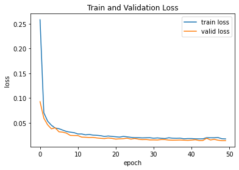
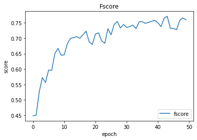
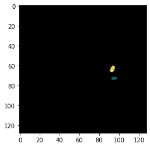
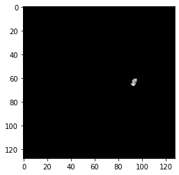
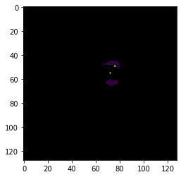
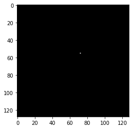
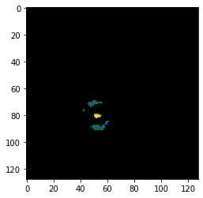
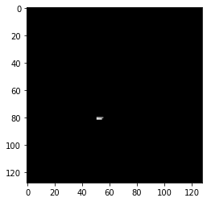

# BraTS2020-2D-PyTorch
2D U-Net implementation in PyTorch for segmenting brain-tumour sub-regions based on data provided by BraTS 2020.

## Background
### Brain Tumour Segmentation (BraTS) Challenge
The BraTS challenge is an annual competition where researchers from around the world compete in creating the best machine learning system for segmenting brain tumour sub-regions from 3D MRI scans [[3]](#3).

### Data
This project uses the BraTS 2020 dataset. The dataset consists of 369 patients where each patient record contains four different volumes of four different modalities plus a volume of the truth segmentation label. Each volume is of size 240x240x155 where there are 240 images from coronal and sagittal views, and 155 images from the axial view. The modalities don't have a specific value range but the truth label only contains four different pixel values where each pixel value represents a sub-region, namely, 0 for background, 1 for necrotic and non-enhancing tumour (NCR/NET), 2 for preitumoral edema (PE), and 4 for enhancing tumour (ET) [[4,5,6]](#4).
```bash
MICCAI_BraTS2020_TrainingData/
├── BraTS20_Training_001
│   ├── BraTS20_Training_001_flair.nii.gz
│   ├── BraTS20_Training_001_seg.nii.gz
│   ├── BraTS20_Training_001_t1ce.nii.gz
│   ├── BraTS20_Training_001_t1.nii.gz
│   └── BraTS20_Training_001_t2.nii.gz
├── BraTS20_Training_002
│   ├── BraTS20_Training_002_flair.nii.gz
│   ├── BraTS20_Training_002_seg.nii.gz
```
## Design
### Preprocessing
In this project, only 2000 2D slices from the axial view are being extracted for training, validation, and testing. All extracted images contain at least a single segmentation pixel in order to avoid processing empty scans. All images are being cropped to 128x128 and all modality images are normalised by subtracting the mean and dividing by the standard deviation before being saved as numpy arrays (.npy).

### Model
The model is a U-Net [[7]](#7) with a ResNet-50 encoder with pre-trained weights from ImageNet. It is imported from qubvel/segmentation_models [[1]](#1).

### Training
60% of the data has been allocated for training, 20% for validation, and 20% for testing purposes. The model accepts a tensor of [batch_size, modalities=4, 128, 128] as the input and a tensor of [batch_size, classes=4, 128, 128] as the target. The modalities are T1, T1ce, T2, and FLAIR stacked together, and the classes are four different channels where each channel represents a different sub-region including the background (one-hot encoded). The output of the model is a tensor of [batch_size, classes=4, 128, 128].

The loss is calculated using the Dice coefficitent, and Adam is used as the optimizer. At each validation step, the Jaccard Index and Dice score is calculated. Based on the Dice metric, the model is saved if the model performs better than every previous model. When calculating the loss and metrics, the background is ignored and softmax is applied to the input.

To improve the model's generalisation ability, the images are augmented with elastic transformation, grid distortion, optical distortion, and random brightness contrast, using albumentations [[2]](#2).

### Evaluation
In addition to the 20% of data reserved for testing the model, a single patient scan from each of the coronal view and sagittal view has been extracted. This is to observe the performance of the model on the same type of data from different views.

### Model Summary
|                       |              |
| -------------         |:-------------|
| Architecture          | U-Net| 
| Encoder               | ResNet-50| 
| Pre-trained weights   | ImageNet|
| Depth                 | 5| 
| Data                  | 2000x128x128|
| Normalisation         | (image - image.mean()) / image.std()|
| Input                 | batchx4x128x128|
| Output                | batchx4x128x128|
| Loss Function         | Dice|
| Optimizer             | Adam (lr=0.0001)|
| Augmentation          | Elastic Transformation<br>Grid Distortion<br>Optical Distortion<br>Random Brightness Contrast  |
| Environment           | Google Colab (with GPU)

## Results
Dice score (fscore) is used as the metric for evaluating the performance of the model.



|View             | Overall Accuracy | NCR/NET | PE | ET |
|:---                   |:---:|:--:|:--:|:--:|
|Axial (test set)       | 0.75|0.76|0.73|0.80|
|Coronal (single scan)  | 0.61|0.72|0.62|0.70|
|Sagittal (single scan) | 0.40|0.62|0.40|0.43|

<br>

|View| Predicted         | Truth Label    |
|:--| :-------------: |:-------------:| 
|Axial|  |  |
|Coronal|  |  |
|Sagittal|  |  |

## Experiments Attempted
- Normalised images between 0-1
- Used only images that have at least 500 pixels of each class
- Trained model with just 800 images
- Tried different number of decoder channels
- Reduced learning rate after the 40th epoch
- Replaced softmax with sigmoid
- Experimented with a variety of augmentation combinations

## Further Work
- Experiment with Cross Entropy Loss as the loss function
- More carefully select the images instead of selecting all the images that have more than one segmentation pixel
- Use more data for training/validating/testing instead of just 2000 images
- Use a different backbone such as a DenseNet

## References
<a id="1">[1]</a> 
P. Yakubovskiy. Segmentation models pytorch. https://github.com/qubvel/segmentation_models.pytorch, 2020.

<a id="2">[2]</a> 
A. Buslaev, V. I. Iglovikov, E. Khvedchenya, A. Parinov, M. Druzhinin, and A. A. Kalinin. Albumentations: Fast and flexible image augmentations. Information, 11(2), 2020

<a id="3">[3]</a> 
Brain  tumor  segmentation  (brats)  challenge  2020:   Scope  —  cbica—  perelman  school  of  medicine  at  the  university  of  pennsylvania.https://www.med.upenn.edu/cbica/brats2020/. (Accessed on 11/25/2020).

<a id="4">[4]</a> 
B. H. Menze, A. Jakab, S. Bauer, J. Kalpathy-Cramer, K. Farahani, J. Kirby, et al. "The Multimodal Brain Tumor Image Segmentation Benchmark (BRATS)", IEEE Transactions on Medical Imaging 34(10), 1993-2024 (2015) DOI: 10.1109/TMI.2014.2377694

<a id="5">[5]</a> 
S. Bakas, H. Akbari, A. Sotiras, M. Bilello, M. Rozycki, J.S. Kirby, et al., "Advancing The Cancer Genome Atlas glioma MRI collections with expert segmentation labels and radiomic features", Nature Scientific Data, 4:170117 (2017) DOI: 10.1038/sdata.2017.117

<a id="6">[6]</a> 
S. Bakas, M. Reyes, A. Jakab, S. Bauer, M. Rempfler, A. Crimi, et al., "Identifying the Best Machine Learning Algorithms for Brain Tumor Segmentation, Progression Assessment, and Overall Survival Prediction in the BRATS Challenge", arXiv preprint arXiv:1811.02629 (2018)

<a id="7">[7]</a> 
O. Ronneberger, P. Fischer, and T. Brox. U-net: Convolutional networks for
biomedical image segmentation. In International Conference on Medical image
computing and computer-assisted intervention, pages 234–241. Springer, 2015.
